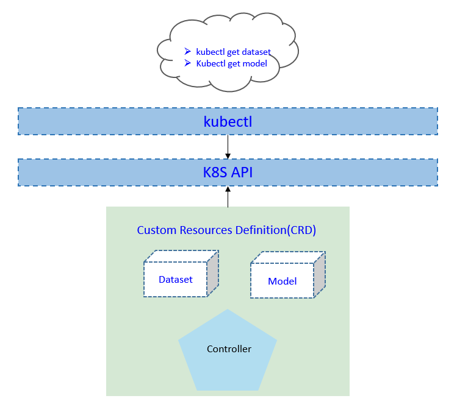
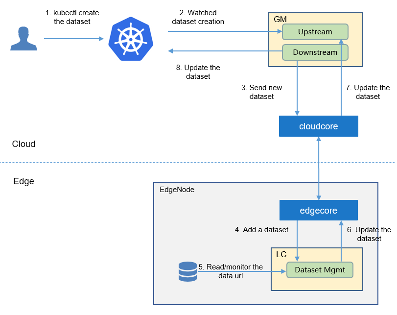

* [Dataset and Model](#dataset-and-model)
   * [Motivation](#motivation)
     * [Goals](#goals)
     * [Non\-goals](#non-goals)
   * [Proposal](#proposal)
     * [Use Cases](#use-cases)
   * [Design Details](#design-details)
     * [CRD API Group and Version](#crd-api-group-and-version)
     * [CRDs](#crds)
     * [Type definition](#crd-type-definition)
     * [Crd sample](#crd-samples)
   * [Controller Design](#controller-design)

# Dataset and Model

## Motivation

Currently, the Edge AI features depend on the object `dataset` and `model`.


This proposal provides the definitions of dataset and model as the first class of k8s resources.

### Goals

* Metadata of `dataset` and `model` objects.
* Used by the Edge AI features 

### Non-goals
* The truly format of the AI `dataset`, such as `imagenet`, `coco` or `tf-record` etc.
* The truly format of the AI `model`, such as `ckpt`, `saved_model` of tensorflow etc.

* The truly operations of the AI `dataset`, such as `shuffle`, `crop` etc.
* The truly operations of the AI `model`, such as `train`, `inference` etc.


## Proposal
We propose using Kubernetes Custom Resource Definitions (CRDs) to describe 
the dataset/model specification/status and a controller to synchronize these updates between edge and cloud.



### Use Cases

* Users can create the dataset resource, by providing the `dataset url`, `format` and the `nodeName` which owns the dataset.
* Users can create the model resource by providing the `model url` and `format`.
* Users can show the information of dataset/model.
* Users can delete the dataset/model. 


## Design Details

### CRD API Group and Version
The `Dataset` and `Model` CRDs will be namespace-scoped.
The tables below summarize the group, kind and API version details for the CRDs.

* Dataset

| Field                 | Description             |
|-----------------------|-------------------------|
|Group                  | sedna.io     |
|APIVersion             | v1alpha1                |
|Kind                   | Dataset             |

* Model

| Field                 | Description             |
|-----------------------|-------------------------|
|Group                  | sedna.io     |
|APIVersion             | v1alpha1                |
|Kind                   | Model             |

### CRDs

#### `Dataset` CRD

[crd source](/build/crds/sedna.io_datasets.yaml)

```yaml
apiVersion: apiextensions.k8s.io/v1
kind: CustomResourceDefinition
metadata:
  name: datasets.sedna.io
spec:
  group: sedna.io
  names:
    kind: Dataset
    plural: datasets
  scope: Namespaced
  versions:
    - name: v1alpha1
      subresources:
        # status enables the status subresource.
        status: {}
      served: true
      storage: true
      schema:
        openAPIV3Schema:
          type: object
          properties:
            spec:
              type: object
              required:
                - url
                - format
              properties:
                url:
                  type: string
                format:
                  type: string
                nodeName:
                  type: string
            status:
              type: object
              properties:
                numberOfSamples:
                  type: integer
                updateTime:
                  type: string
                  format: datatime


      additionalPrinterColumns:
        - name: NumberOfSamples
          type: integer
          description: The number of samples in the dataset
          jsonPath: ".status.numberOfSamples"
        - name: Node
          type: string
          description: The node name of the dataset
          jsonPath: ".spec.nodeName"
        - name: spec
          type: string
          description: The spec of the dataset
          jsonPath: ".spec"

```
1. `format` of dataset

We use this field to report the number of samples for the dataset and do dataset splitting.

Current we support these below formats:
    
- txt: one nonempty line is one sample

#### `Model` CRD

[crd source](/build/crds/sedna.io_models.yaml)
```yaml
apiVersion: apiextensions.k8s.io/v1
kind: CustomResourceDefinition
metadata:
  name: models.sedna.io
spec:
  group: sedna.io
  names:
    kind: Model
    plural: models
  scope: Namespaced
  versions:
    - name: v1alpha1
      subresources:
        # status enables the status subresource.
        status: {}
      served: true
      storage: true
      schema:
        openAPIV3Schema:
          type: object
          properties:
            spec:
              type: object
              required:
                - url
                - format
              properties:
                url:
                  type: string
                format:
                  type: string
            status:
              type: object
              properties:
                updateTime:
                  type: string
                  format: datetime
                metrics:
                  type: array
                  items:
                    type: object
                    properties:
                      key:
                        type: string
                      value:
                        type: string


      additionalPrinterColumns:
        - name: updateAGE
          type: date
          description: The update age
          jsonPath: ".status.updateTime"
        - name: metrics
          type: string
          description: The metrics
          jsonPath: ".status.metrics"

```

### CRD type definition
- `Dataset`

[go source](/pkg/apis/sedna/v1alpha1/dataset_types.go)

```go
package v1alpha1

import (
	metav1 "k8s.io/apimachinery/pkg/apis/meta/v1"
)

// +genclient
// +k8s:deepcopy-gen:interfaces=k8s.io/apimachinery/pkg/runtime.Object

// Dataset describes the data that a dataset resource should have
type Dataset struct {
	metav1.TypeMeta `json:",inline"`

	metav1.ObjectMeta `json:"metadata,omitempty"`

	Spec   DatasetSpec   `json:"spec"`
	Status DatasetStatus `json:"status"`
}

// DatasetSpec is a description of a dataset
type DatasetSpec struct {
	URL  string `json:"url"`
	Format   string `json:"format"`
	NodeName string `json:"nodeName"`
}

// DatasetStatus represents information about the status of a dataset
// including the time a dataset updated, and number of samples in a dataset
type DatasetStatus struct {
	UpdateTime      *metav1.Time `json:"updateTime,omitempty" protobuf:"bytes,1,opt,name=updateTime"`
	NumberOfSamples int          `json:"numberOfSamples"`
}

// +k8s:deepcopy-gen:interfaces=k8s.io/apimachinery/pkg/runtime.Object

// DatasetList is a list of Datasets
type DatasetList struct {
	metav1.TypeMeta `json:",inline"`
	metav1.ListMeta `json:"metadata"`

	Items []Dataset `json:"items"`
}

```

- `Model`

[go source](/pkg/apis/sedna/v1alpha1/model_types.go)
```go
package v1alpha1

import (
	metav1 "k8s.io/apimachinery/pkg/apis/meta/v1"
)

// +genclient
// +k8s:deepcopy-gen:interfaces=k8s.io/apimachinery/pkg/runtime.Object

// Model describes the data that a model resource should have
type Model struct {
	metav1.TypeMeta `json:",inline"`

	metav1.ObjectMeta `json:"metadata,omitempty"`

	Spec   ModelSpec   `json:"spec"`
	Status ModelStatus `json:"status"`
}

// ModelSpec is a description of a model
type ModelSpec struct {
	URL string `json:"url"`
	Format   string `json:"format"`
}

// ModelStatus represents information about the status of a model
// including the time a model updated, and metrics in a model
type ModelStatus struct {
	UpdateTime *metav1.Time `json:"updateTime,omitempty" protobuf:"bytes,1,opt,name=updateTime"`
	Metrics    []Metric     `json:"metrics,omitempty" protobuf:"bytes,2,rep,name=metrics"`
}

// +k8s:deepcopy-gen:interfaces=k8s.io/apimachinery/pkg/runtime.Object

//  ModelList is a list of Models
type ModelList struct {
	metav1.TypeMeta `json:",inline"`
	metav1.ListMeta `json:"metadata"`

	Items []Model `json:"items"`
}

```

### Crd samples
- `Dataset`

```yaml
apiVersion: sedna.io/v1alpha1
kind: Dataset
metadata:
  name: "dataset-examp"
spec:
  url: "/code/data"
  format: "txt"
  nodeName: "edge0"
```

- `Model`

```yaml
apiVersion: sedna.io/v1alpha1
kind: Model
metadata:
  name: model-examp
spec:
  url: "/model/frozen.pb"
  format: pb
```


## Controller Design
In the current design there is downstream/upstream controller for `dataset`, no downstream/upstream controller for `model`.<br/>
 
The dataset controller synchronizes the dataset between the cloud and edge.
- downstream: synchronize the dataset info from the cloud to the edge node.
- upstream: synchronize the dataset status from the edge to the cloud node, such as the information how many samples the dataset has.
<br/>

Here is the flow of the dataset creation:



For the model:
1. Model's info will be synced when sync the federated-task etc which uses the model.
1. Model's status will be updated when the corresponding training/inference work has completed. 

