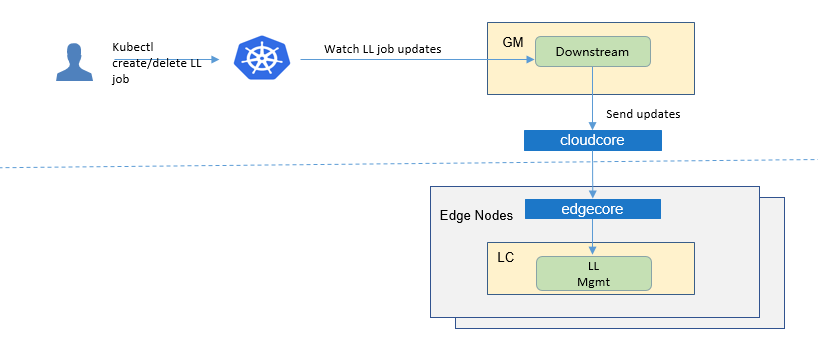
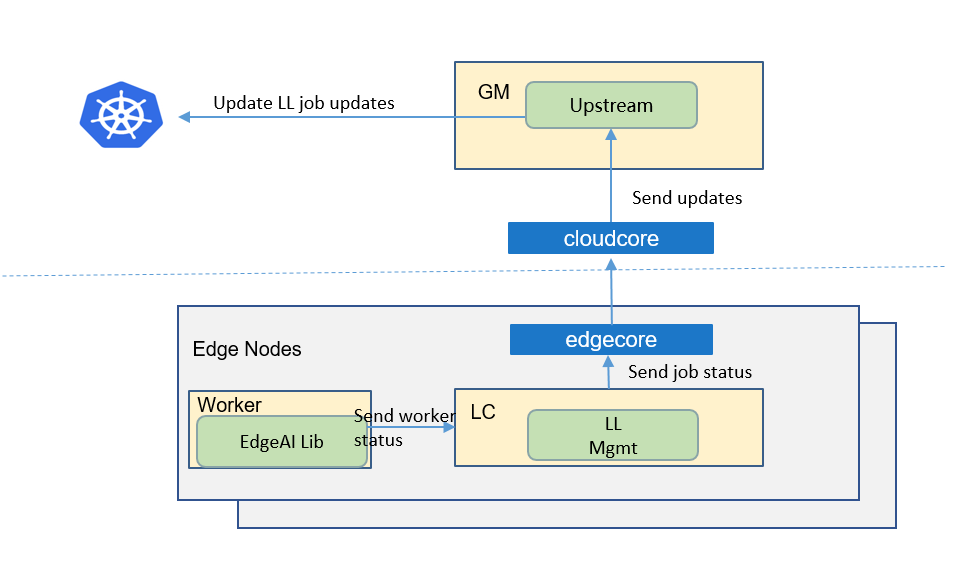
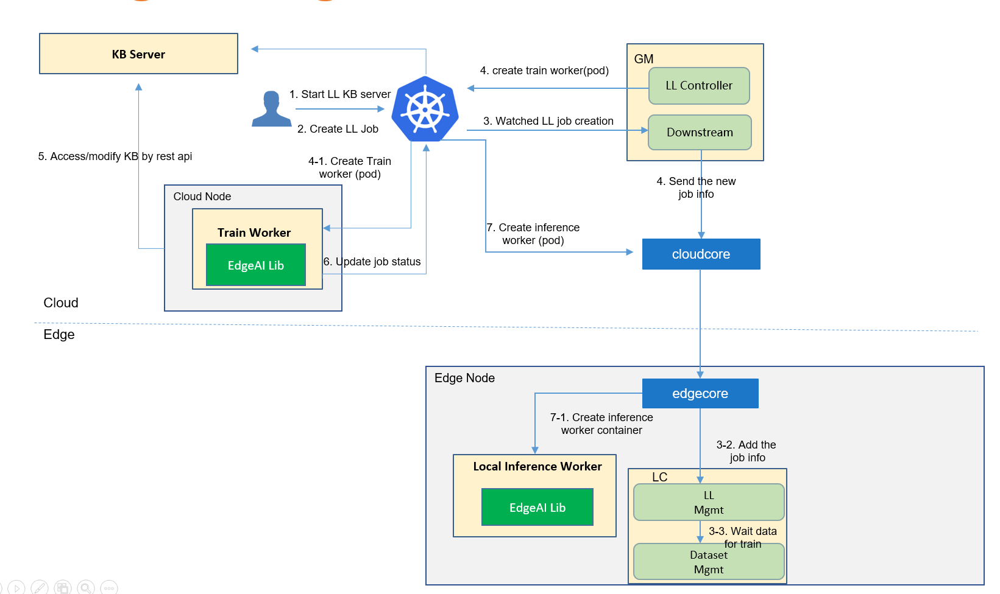
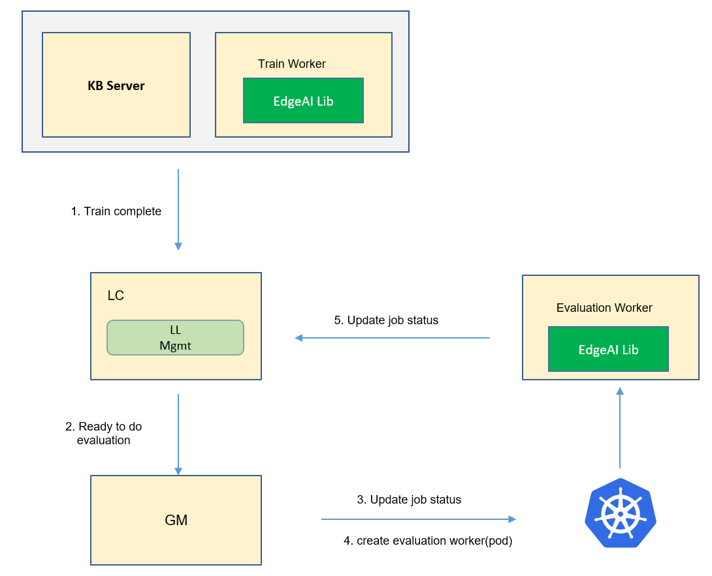
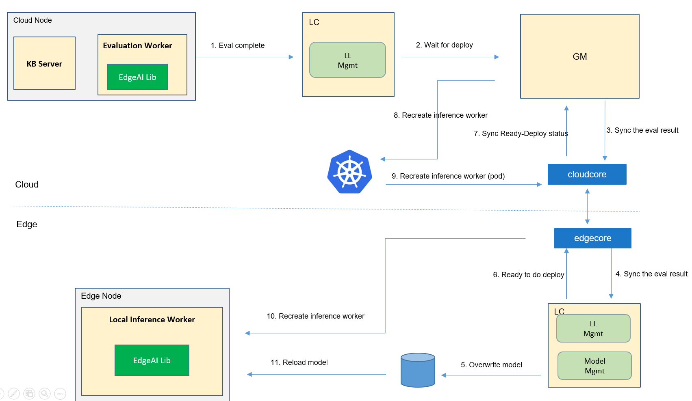

* [Lifelong Learning](#lifelong-learning)
   * [Goals](#goals)
   * [Proposal](#proposal)
     * [Use Cases](#use-cases)
   * [Design Details](#design-details)
     * [CRD API Group and Version](#crd-api-group-and-version)
     * [Lifelong learning CRD](#lifelong-learning-crd)
     * [Lifelong learning type definition](#lifelong-learning-job-type-definition)
     * [Lifelong learning sample](#lifelong-learning-job-sample)
     * [Validation](#validation)
   * [Controller Design](#controller-design)
     * [Lifelong Learning Controller](#lifelong-learning-controller)
     * [Downstream Controller](#downstream-controller)
     * [Upstream Controller](#upstream-controller)
     * [Details of api between GM(cloud) and LC(edge)](#details-of-api-between-gmcloud-and-lcedge)
   * [Workers Communication](#workers-communication)

# Lifelong Learning
## Goals
In this version of Sedna lifelong learning framework, we realize the following features:

* edge-cloud collaborative continuous learning.
* Knowledge sharing across the edge of the cloud.
* Automatic discovery and transfer learning of new knowledge.

## Proposal
We propose using Kubernetes Custom Resource Definitions (CRDs) to describe 
the lifelong learning specification/status and a controller to synchronize these updates between edge and cloud.

### Use Cases

* Users can create the lifelong learning jobs, by providing training scripts, configuring training hyperparameters, providing training datasets, configuring training and deployment triggers.

## Design Details
There are three stages in a lifelong learning job: train/eval/deploy.

Each stage contains these below states:
1. Waiting: wait to trigger satisfied, i.e. wait to train/eval/deploy
1. Ready: the corresponding trigger satisfied, now ready to train/eval/deploy
1. Starting: the corresponding stage is starting
1. Running: the corresponding stage is running
1. Failed: the corresponding stage failed
1. Completed: the corresponding stage completed

### CRD API Group and Version
The `LifelongLearningJob` CRD will be namespace-scoped.
The tables below summarize the group, kind and API version details for the CRD.

* LifelongLearningJob

| Field                 | Description             |
|-----------------------|-------------------------|
|Group                  | sedna.io     |
|APIVersion             | v1alpha1                |
|Kind                   | LifelongLearningJob             |

### Lifelong learning CRD
See the [crd source](/build/crds/sedna/sedna.io_lifelonglearningjobs.yaml) for details.

### Lifelong learning job type definition

See the [golang source](/pkg/apis/sedna/v1alpha1/lifelonglearningjob_types.go) for details.

#### Validation
[Open API v3 Schema based validation](https://kubernetes.io/docs/tasks/access-kubernetes-api/custom-resources/custom-resource-definitions/#validation) can be used to guard against bad requests.
Invalid values for fields (example string value for a boolean field etc) can be validated using this.

Here is a list of validations we need to support :
1. The `dataset` specified in the crd should exist in k8s.
1. The edgenode name specified in the crd should exist in k8s.

### Lifelong learning job sample
See the [source](/build/crd-samples/sedna/lifelonglearningjob_v1alpha1.yaml) for an example.
    
## Controller Design

The Lifelong learning controller starts three separate goroutines called `upstream`, `downstream` and `Lifelonglearningjob`controller. 
These are not separate controllers as such but named here for clarity.
- Lifelong learning: watch the updates of lifelong-learning job crds, and create the workers depending on the state machine.
- downstream: synchronize the lifelong-learning-job updates from the cloud to the edge node.
- upstream: synchronize the lifelong-learning-job updates from the edge to the cloud node.

### Lifelong Learning Controller

The lifelong-learning controller watches for the updates of lifelong-learning jobs and the corresponding pods against the K8S API server. 
Updates are categorized below along with the possible actions:

| Update Type                    | Action                                       |
|-------------------------------|---------------------------------------------- |
|New lifelong-learning-job Created             | Wait to train trigger satisfied|
|lifelong-learning-job Deleted                 | NA. These workers will be deleted by [k8s gc](https://kubernetes.io/docs/concepts/workloads/controllers/garbage-collection/).|
|The Status of lifelong-learning-job Updated               | Create the train/eval worker if it's ready.|
|The corresponding pod created/running/completed/failed                 | Update the status of lifelong-learning job.|

### Downstream Controller

The downstream controller watches for the lifelong-learning job updates against the K8S API server. 
Updates are categorized below along with the possible actions that the downstream controller can take:

| Update Type                    | Action                                       |
|-------------------------------|---------------------------------------------- |
|New Lifelong-learning-job Created             |Sends the job information to LCs.|
|Lifelong-learning-job Deleted                 | The controller sends the delete event to LCs.|

### Upstream Controller

The upstream controller watches for the lifelong-learning job updates from the edge node and applies these updates against the API server in the cloud. 
Updates are categorized below along with the possible actions that the upstream controller can take:

| Update Type                        | Action                                        |
|-------------------------------     |---------------------------------------------- |
|Lifelong-learning-job Reported State Updated    |  The controller appends the reported status of the job by LC in the cloud. |

### Details of api between GM(cloud) and LC(edge)
[Reference](https://github.com/dayu-autostreamer/dayu-sedna/blob/main/docs/proposals/incremental-learning.md#details-of-api-between-gmcloud-and-lcedge)

### The flows of lifelong learning job
- Flow of the job creation:

- Flow of the `train` stage:

- Flow of the `eval` stage:

- Flow of the `deploy` stage:

## Workers Communication
No need to communicate between workers.
